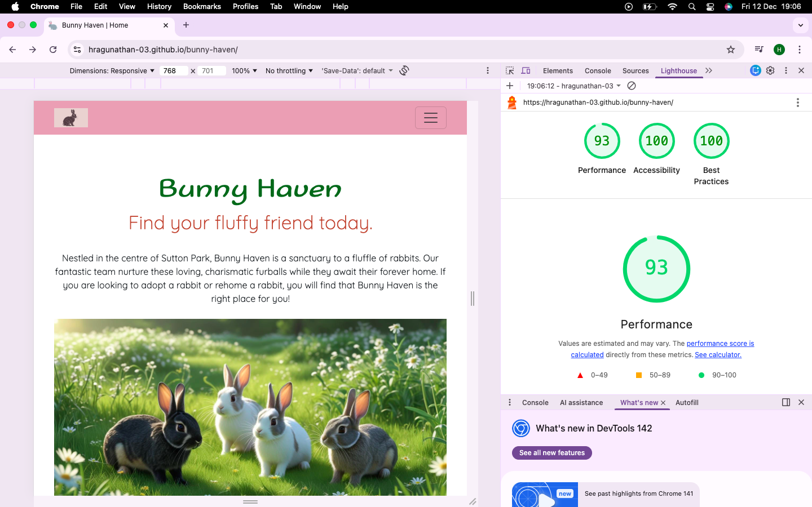
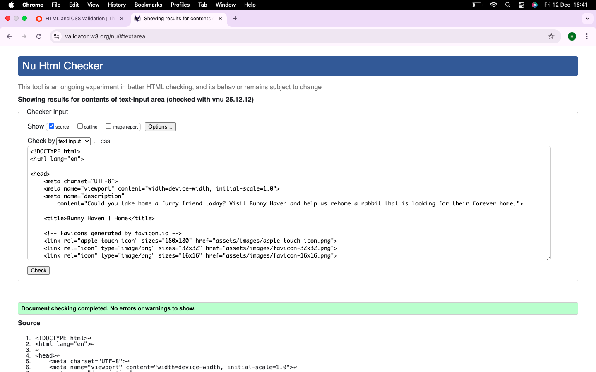
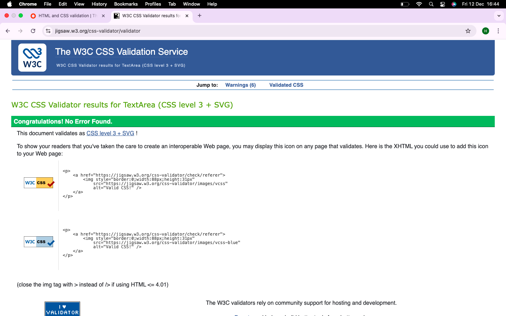
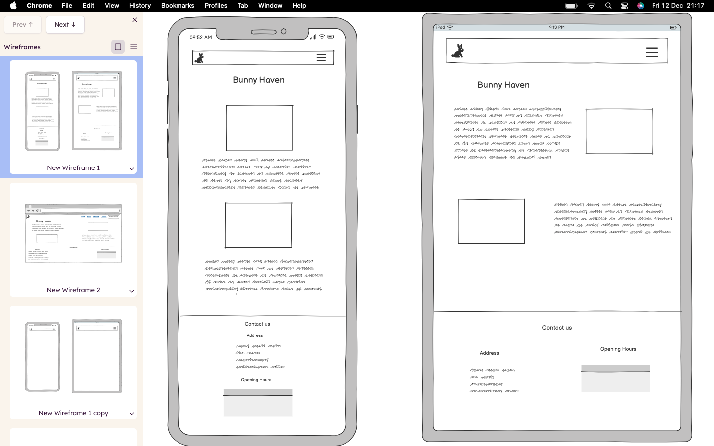
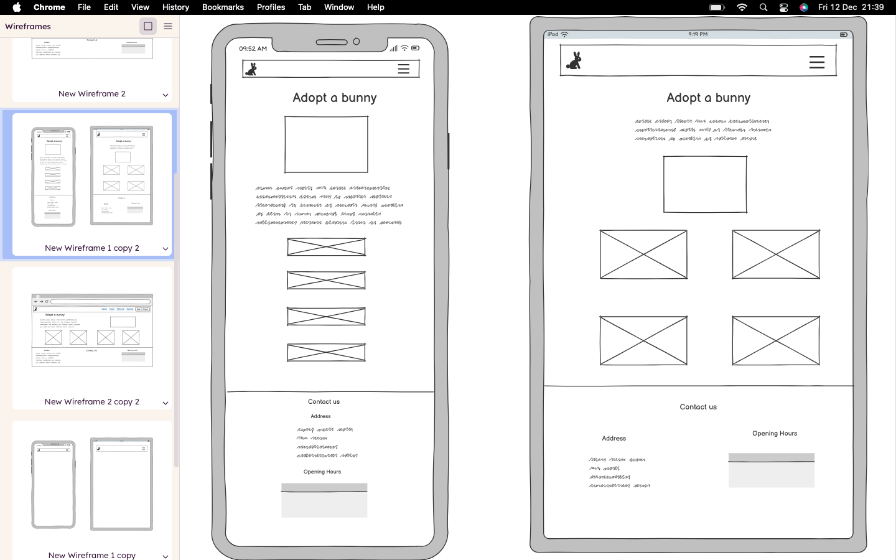
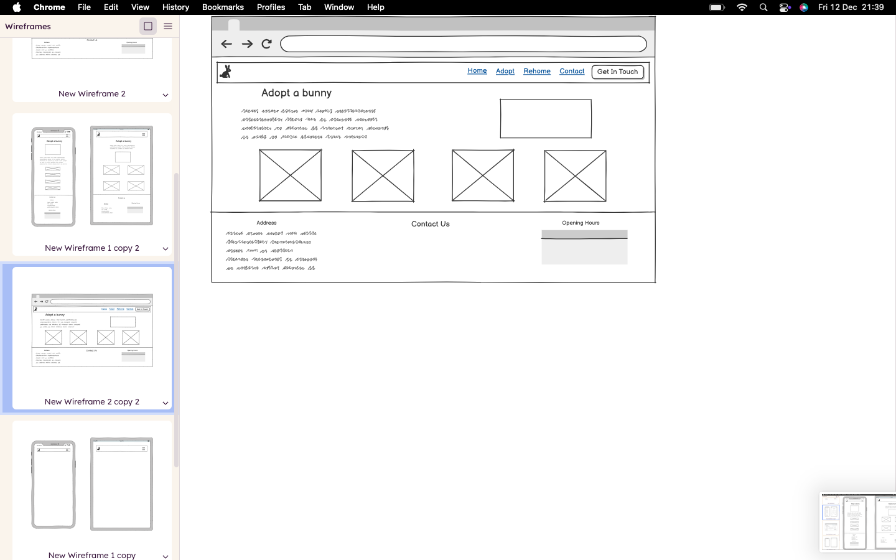
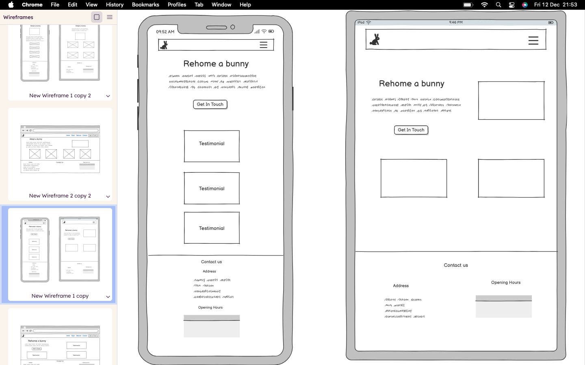
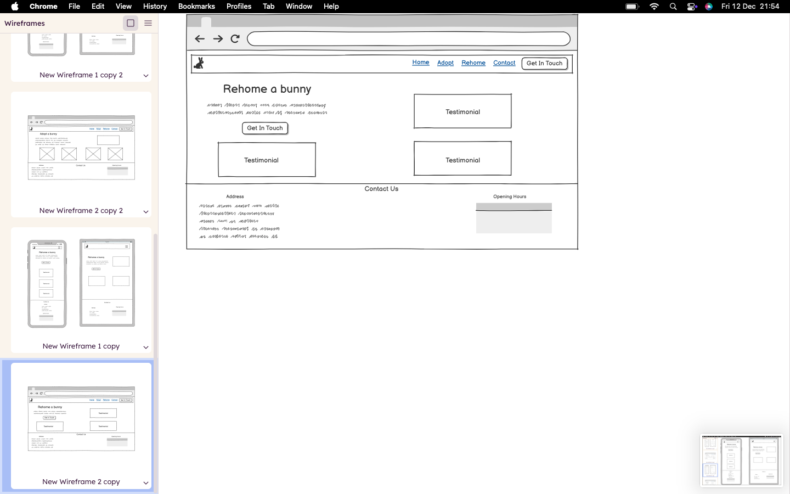

# Bunny Haven

The primary goal of this website is to find a new home for rabbits that have been abandoned, rabbits that have been rescued, and rabbits that need to be rehomed. This site will be useful to users that are either looking to provide a home for a rabbit, or looking to rehome their own rabbit.

Creating an informative, clear, and easy to navigate website will suppport the primary goal. It will mean that users can quickly find the information they need with ease, and can contact Bunny Haven to rehome/adopt a rabbit.

## User Stories

- As someone who is thinking of adopting a rabbit, I would like to be able to navigate the website intuitively, on any device, so that I am able to find the information I need quickly. 
*The website has a navigation bar that allows the user to easily find what they are looking for.*

- As a rabbit lover that is looking to adopt, I would like a dedicated page for rabbits that are looking for a new home, so that I can find my forever bunny easily, and adopt it!

*The "Meet Our Bunnies" page contains pictures of bunnies that are available. Each picture is accompanied with a short description to help the user decide which bunny to choose.*

- Once I have found a rabbit to adopt, I would like to contact Bunny Haven to make enquiries and start the adoption process.

*The "Get In Touch" page enables the user to contact Bunny Haven easily and make enquiries regarding adoption or rehoming. The button for this page is on the navigation bar. The contrasting colour of the button makes it stand out on the navigation bar, allowing the user to see it easily.*

- As someone looking to rehome their rabbits, I would like to be able to find the location and contact information of Bunny Haven, so that I can get in touch or visit.

*The "Contact Us" section is present on the bottom of each page across the website. This allows the user to find these details effortlessly.*

### Design Choices

- **Colours:** The shade of pink across the website was chosen as it evokes a calm, loving feel which is the feeling that adopting a rabbit would give.   
The shades of green that were used, compliment the pink, while also tying in with the scenes of nature found in the images on the website.

- **Fonts:** Sofadi One was used for the main headings as it has a soft and rounded feel, just like rabbits. Quicksand was chosen for the main text content as it was easy to read and inviting.

- **Styling:** When making styling decisions, the main focus was on providing a clean, easy to navigate website for positive user experience.  
High-quality images were used throughout the website to improve user experience.
The image carousel and testimonial cards on the Homepage were used to draw the users attention.  
The cards for the Adopt page were chosen to display the available rabbits in a neat, concise layout.

## Testing

### Manual Testing

**Procedure:**
For each page of the website:
- Read the written content carefully and check for errors.
- Ensure that all links in the navigation bar are working properly, and directing the user to the correct information/page.
- Check each link in the "Contact Us" section is redirecting the user to the correct social stream.
- Check that all input fields on the form are accepting the correct type of input, and that the form can only be submitted when all fields are filled in accurately.
- Check the carousel slides automatically, and that it works as intended for the user.
- Ensure that the website displays in the right format on different screen sizes.

**Results:**
- Tested carousel on the Homepage. Autoplay is working. The previous/next controls and indicators were not working correctly.
*This was fixed by correcting the carousel id.*

- Tested responsiveness across different screen sizes and noticed that there were some alignment issues on the "Adopt a bunny" section on tablet screens. 
*This issue was fixed by targeting the carousel-adopt id in the media queries.*

- *Added fixed-top class to the navbar on all pages to improve the user experience.*

- Tested the links on the navbar. This showed that when pressing the Rehome link, the fixed navbar is hiding the "Rehome a bunny" section. 
*This was fixed by changing the properties of the "section" class on CSS.*

- On smaller screens, clicking on the burger icon opens the dropdown, but hides the page content.
*This was fixed by using the Javascript code provided for the Boardwalk Games project, to close the navbar once the user has clicked the link.*

- Testing the Adopt page showed that the cards in the "Meet the bunnies" page are not centered on smaller screen. This issue is yet to be fixed.

- Checked "Get in touch" form to ensure that HTML validation is working.

- Checked that the deployed site is working as intended.

### Automated Testing

- Testing with Lighthouse on DevTools showed the following scores:
1. Performance - 93
2. Accessibility - 100
3. Best Practices - 100    

      
- Any remaining performace issues are yet to be fixed. 

- Checking the HTML code with the Nu HTML validator showed no issues.

- Used the Autoprefixer tool to add prefixes to the CSS code.

- Checking the CSS code with the W3C CSS validator showed no issues.

### Sources & Attributions

1. Code Institute Boardwalk Games Project - The videos for this project were used alongside the building of this website, tackling errors, and fixing bugs. 
2. [Bootstrap](https://getbootstrap.com) for navbar, cards, carousel.
3. [Canva](https://canva.com) to generate all of the images and the logo using the AI generator.
4. W3C HTML and CSS validators, Autoprefixer tool, DevTools/Lighthouse for fixing any encountered issues.
5. [GitHub](https://github.com) and GitHub pages for creating the project and deployment.
6. [Markdown](https://markdownguide.org) for help with markdown syntax.
7. [Imagecolorpicker](https://imagecolorpicker.com/) for picking colours for the website.
8. [WebAim](https://webaim.org/resources/contrastchecker/) for checking the web accesibility of the chosen colours.
9. [Font Awesome](https://fontawesome.com/) for the icons.
10. Code2020 on YouTube for instructions on how to add screenshots/images to the readme file.
11. Pam Tech Coding on YouTube for instructions on how to deploy to github pages.

## Project Deployment   

To create and deploy a project, please use the following steps:

**Steps to create a project:**

1. Open GitHub and click on the green button to create a new repository.
2. Choose a repository name, and make sure to select "public".
3. Next, press the "Create a repository" button.
4. Copy the code to create a new repository on the command line.
5. Create a new folder with the same name as the new repository.
6. Use VSCode to open the new folder.
7. Open the terminal, paste the copied code (from GitHub) and press enter.
8. Create HTML and CSS files.
9. Write, commit and push your code.
       

**Steps to deploy a project:**

1. On GitHub, open the repository that you would like to deploy to Github Pages.
2. Select "Settings", and then "Pages".
3. For "Source", select "Deploy from a branch". 
4. For "Branch", select "Main". Then click "Save".
5. You have now deployed your project (This can take a few minutes).
   
## Wireframes  

  

#### Project created by Hamshini Ragunathan

[Bunny Haven](https://hragunathan-03.github.io/bunny-haven/) - This is a link to the deployed project.

